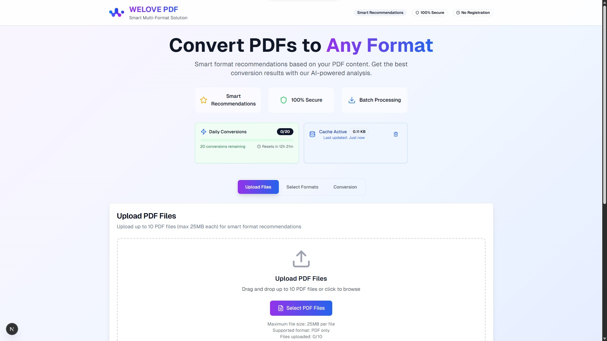

# WeLove PDF

A modern web application for managing and viewing PDF files with a clean, user-friendly interface. Built with Next.js, TypeScript, and Tailwind CSS.



## ✨ Features

- 📄 Upload and view PDF files
- 🔍 Search within PDF documents
- 📱 Responsive design for all devices
- 🎨 Clean and modern user interface
- ⚡ Fast and efficient PDF rendering

## 🚀 Getting Started

### Prerequisites

- Node.js 16.8 or later
- npm or yarn

### Installation

1. Clone the repository:
   ```bash
   git clone https://github.com/RacoonHQ/WELOVE-PDF---Convert-PDF-To-Many-Formats.git
   cd WELOVE_PDF
   ```

2. Install dependencies:
   ```bash
   npm install
   # or
   yarn
   ```

3. Start the development server:
   ```bash
   npm run dev
   # or
   yarn dev
   ```

4. Open [http://localhost:3000](http://localhost:3000) in your browser to see the result.

## 🛠️ Tech Stack

- **Framework**: [Next.js](https://nextjs.org/)
- **Language**: [TypeScript](https://www.typescriptlang.org/)
- **Styling**: [Tailwind CSS](https://tailwindcss.com/)
- **UI Components**: [Radix UI](https://www.radix-ui.com/)
- **PDF Processing**: [PDF.js](https://mozilla.github.io/pdf.js/)
- **State Management**: React Context API
- **Form Handling**: React Hook Form
- **Icons**: [Lucide Icons](https://lucide.dev/)

## 📂 Project Structure

```
welike-pdf/
├── .next/                 # Next.js build output
├── node_modules/          # Dependencies
├── public/                # Static files
├── src/
│   ├── components/        # Reusable UI components
│   ├── context/           # React context providers
│   ├── hooks/             # Custom React hooks
│   ├── lib/               # Utility functions and configurations
│   ├── pages/             # Next.js pages
│   ├── styles/            # Global styles and Tailwind config
│   └── types/             # TypeScript type definitions
├── .eslintrc.json         # ESLint configuration
├── .gitignore             # Git ignore file
├── next.config.js         # Next.js configuration
├── package.json           # Project dependencies and scripts
├── postcss.config.js      # PostCSS configuration
├── README.md              # This file
└── tailwind.config.js     # Tailwind CSS configuration
```

## 🧪 Testing

Run the test suite:

```bash
npm test
# or
yarn test
```

## 🚀 Deployment

1. **Build the application**:
   ```bash
   npm run build
   # or
   yarn build
   ```

2. **Start the production server**:
   ```bash
   npm start
   # or
   yarn start
   ```

## 🤝 Contributing

Contributions are welcome! Please follow these steps:

1. Fork the repository
2. Create a feature branch (`git checkout -b feature/AmazingFeature`)
3. Commit your changes (`git commit -m 'Add some AmazingFeature'`)
4. Push to the branch (`git push origin feature/AmazingFeature`)
5. Open a Pull Request

## 📄 License

This project is licensed under the MIT License - see the [LICENSE](LICENSE) file for details.

## 👥 Team

- **Developer**: [RacoonHQ](https://github.com/RacoonHQ)
- **Design**: [RacoonHQ](https://github.com/RacoonHQ)

## 🙏 Acknowledgments

- [Next.js Documentation](https://nextjs.org/docs)
- [Tailwind CSS Documentation](https://tailwindcss.com/docs)
- [Radix UI Documentation](https://www.radix-ui.com/docs)
